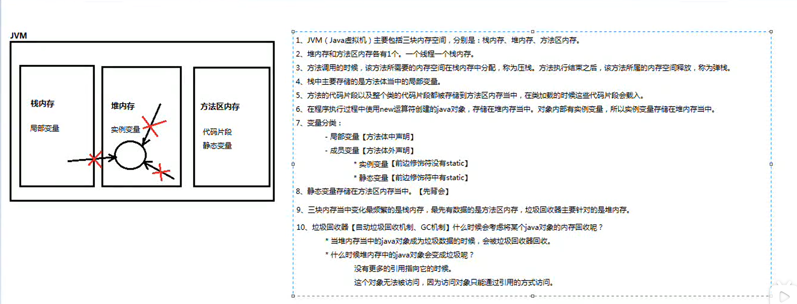

##jvm虚拟机主要包含三个空间:
* 分别是 栈内存,堆内存,方法区
* 堆内存和方法区各有一个,一个线程一个栈内存
* 方法调用的时候,该方法所需要的内存空间在栈内存中分配,称为压栈,执行完之后,所属的内存空间释放,称为弹栈
* 栈中存储的主要是方法体当中的局部变量
* 代码片段被放到方法区里面,在类加载的时候 代码片段会被调用
* 执行new 运算符创建的对象,存储在堆内存当中,对象内部有实例变量,所以实例变量存放在堆内存当中
  * 变量分类:
    * 局部变量: [方法体中申明]
    * 成员变量: [方法体外申明]
      * 实例变量: [前面无static修饰符]
      * 静态变量: [前面有static修饰符]
  * 