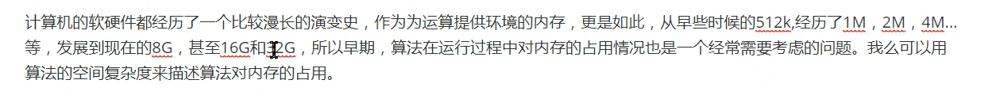
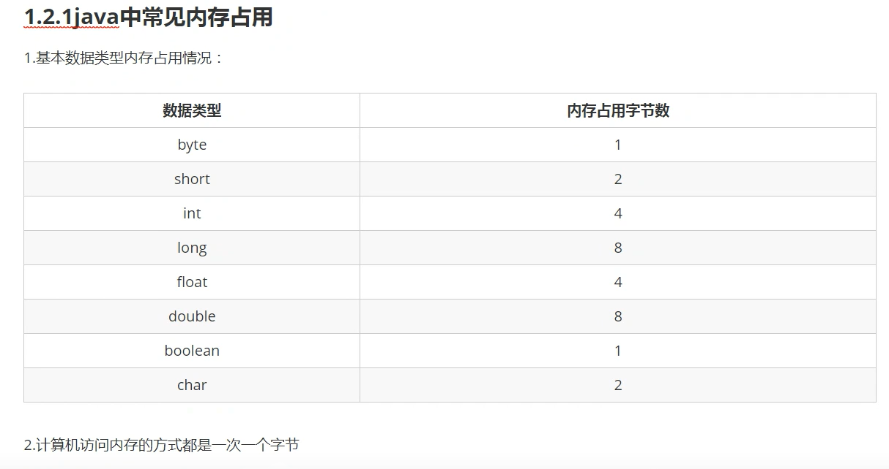
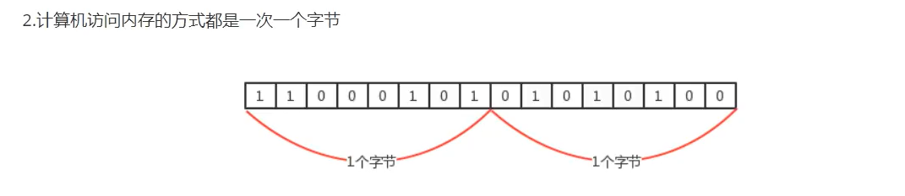
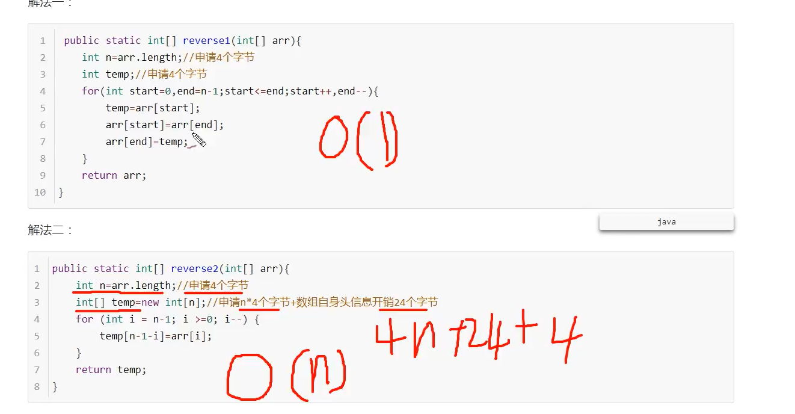

### 传统上,我们将数据结构分为 [逻辑结构] 和 [物理结构] 两大类

- 逻辑结构:[逻辑结构]是从具体问题里抽象出来的模型,是抽象意义上的结构,按照对象中元素之间的相互关系分类
    * 集合结构: 集合结构中 除了数据元素属于同一个集合外 他们之间没有其他的关系
    * 线性结构: 线性结构 中的数据之间存在一对一的关系
    * 树形结构: 树形结构中的元素数据之间存在一对多的层次关系
- 物理结构: [逻辑结构]在计算机中的阵阵表示方式 又被称为物理结构(映像) 也可以叫做存储结构. 常见的物理结构有:
    - 顺序存储结构:
        - 把数据元素放到地址连续的存储单元里面,其数据间的逻辑关系和物理关系是一致的,比如数组 -链式存储:
        - 把数据元素存放在任意的存储单元里面 这组存储单元可以不连续 此时数据之间并不能反应元素之间的逻辑关系,因此在链式存储结构中引进了一个指针存放数据元素的地址,通过地址 来找到关联元素的位置

### 优秀的算法应该追求以下三个目标:

* 花最少的时间完成需求
* 占用最少的内存完成需求
* 能够达到更高的性能释放

### 时间复杂度:

* 在进行算法分析时,语句总的执行此时T(n)是关于问题规模n的函数
* 进而分析T(n)随着n的变化情况并确定T(n)的量级
* 算法的时间复杂度 就是算法的时间量度,记作T(n) = O(f(n))
* 她表示的是随着问题规模 n 的增加 算法执行时间的增长率和 f(n) 的增长率相同 称作算法的渐进时间复杂度.
* 简称时间复杂度,其中f(n) 是关于问题规模 n 的某个函数

#### 在这里我们需要明白 执行次数 = 执行时间

* 一般来说随着输入规模n的增大 T(n) 增长最慢的算法为最优算法
* 用大写O()来体现算法时间复杂度的记法 我们称之为 大O记法
    * 推导大O阶的表示法有以下几个规则可以使用:
        1. ## 用常数1代替运行时间中的所有加法常数;
        2. ## 在修改获得运行次数中,只保留高阶项;
        3. ## 如果最高阶存在 且常数因子不为1 则去除与这个项相乘的常熟 
* 常见的大O阶
  * 线性阶
    * 一般含邮费嵌套循环设计线性阶, 线性阶就是随着输入规模的增大 ,对应计算次数成直线增长 , 类似一次函数,for循环里面自增;
  * 平方阶
    * 一般嵌套循环属于这种时间复杂度 ,例如 两个循环嵌套里面自增;
  * 立方阶
    * 一般三层嵌套
  * 对数阶
  * 对于高中数学内容 我们以分析程序为主,数学为辅
    ```
    int i = 1;
    int n = 100;
    while (i<n) {i = i*2;}
    
``由于每次i*2之后,就距离n更进一步 假设有x个2相乘后大于n,则会退出循环.由于2^x=n,得到x = log(2)n 素偶i这个循环的时间复杂度为O (logn)
   

##算法的空间复杂度分析
- 
- 
2. 计算机访问内存一次一个字节
3. 
4. 一个引用(机器地址) 需要8个字节标识:
   1. 例如: Date date = new Date() 则这个变量需要占用8个字节来标识
5. 创建一个对象 比如 new Date() 除了Date对象内部储存的数据 (例如年月日信息等) 占用的内存 该对象本身也有内存开销 每个对象的自身开销是16字节 用来保存对象的头信息
6. 一般内存的使用如果不够8字节 会填充为8字节
    - 例如:
```java
public class A {
    public int a = 1;
}
//通过new A() 创建一个对象的内存占用如下 :
// 1. 整形成员变量a占用4个字节; 
// 2. 对象本身占用16个字节
//所以创建该对象总共需要20个字节,单体英语不是以8 位单位,会 自动填充为 24 个 字节
```


####案例:
