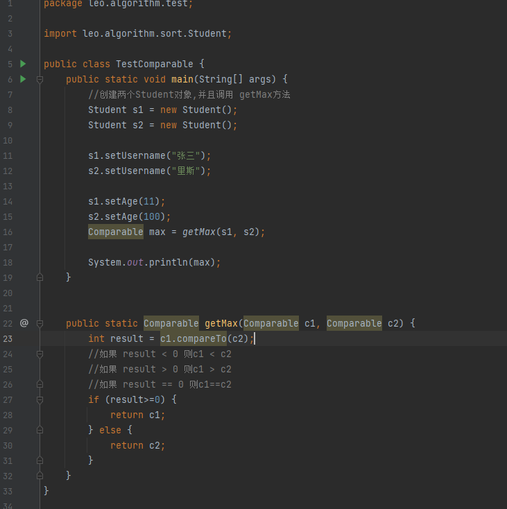
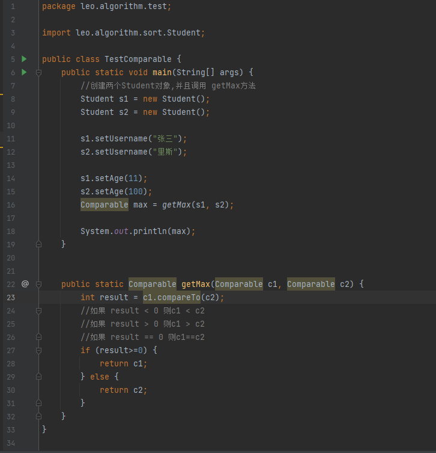
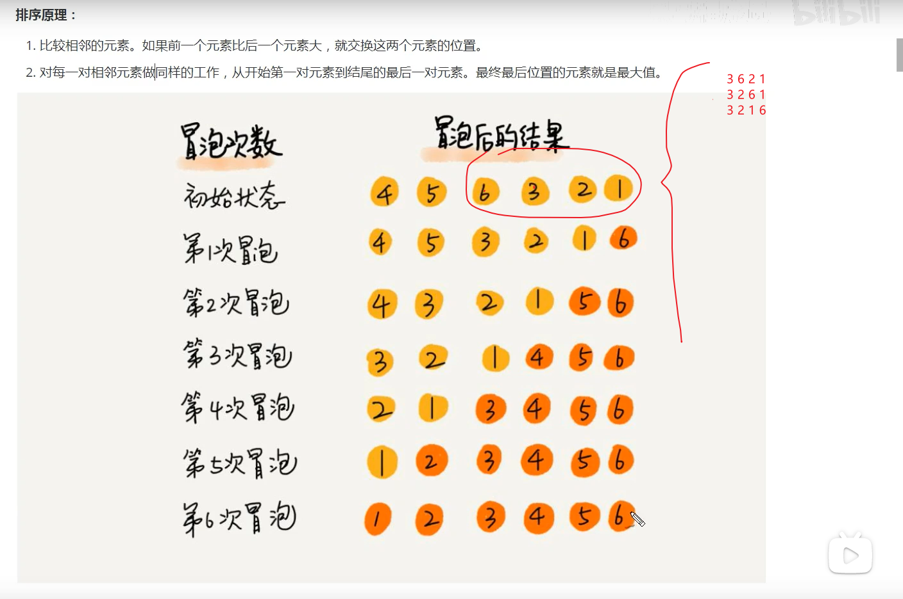

# 一. 简单排序
##1.1 Comparable接口
* 需求:
  * 
    1.定义一个学生类 fangfa.Student,具有年龄age 和 username两个属性
  
  * 
    2.定义测试类Test 在测试类中定义测试方法 Comparable getMax(Comparable c1,Comparable c2) 完成测试
  * 

    
##1.2 冒泡排序
*原理:
